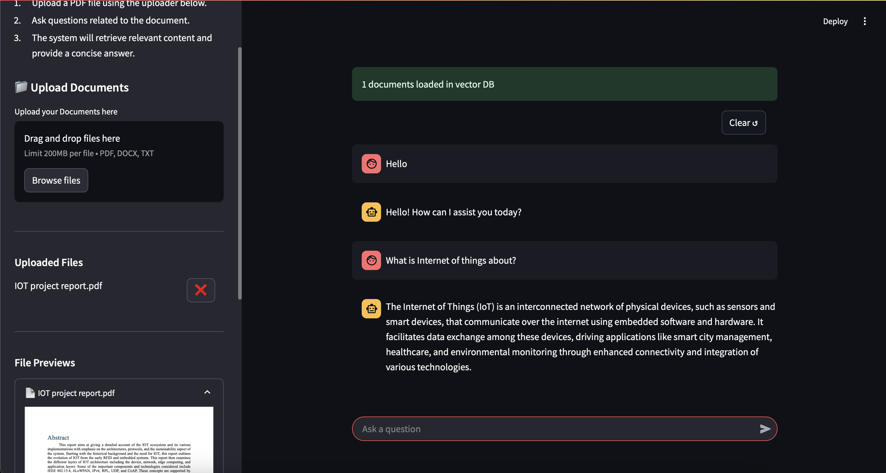

# Local RAG Assistant with DeepSeek-R1

[](https://www.python.org/)

A locally-running Retrieval Augmented Generation (RAG) system that enables document analysis and question answering using DeepSeek.
<div style="text-align: center;">

</div>

## Features

- **Document Upload** (PDF, DOCX, TXT)
- **Interactive File Previews**
- **Local AI Processing** with DeepSeek-r1
- **Conversational Interface**
- **Vector Database Integration**
- **Cross-document Search Capabilities**

## Architecture
<div style="text-align: center;">

</div>

## Usage

To install and use locally, the following steps could be followed

### Prerequisites

1. **Ollama Installation**: [Ollama install](https://ollama.com/download)
2. **Deepseek-r1 Installation**: [Deepseek download](https://huggingface.co/deepseek-ai/DeepSeek-R1-Distill-Qwen-1.5B)

### Installation

#### Clone repository

```bash
git clone https://github.com/busayojee/RAG.git
```

#### Create virtual environment

```bash
python -m venv venv
source venv/bin/activate 
```

#### Install dependencies

```bash
pip install -r requirements.txt
```

- **Update ModelFile to include deepseek-r1 path**

#### Add to Ollama

```bash
ollama create deepseek-1.5 -f Modelfile
```

#### Start the application

```bash
streamlit run main.py
```

## Contributing

Contributions are welcome! If you'd like to improve the app.

---
